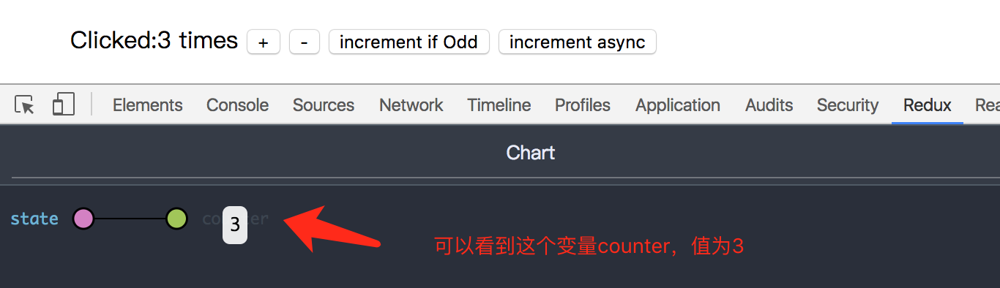
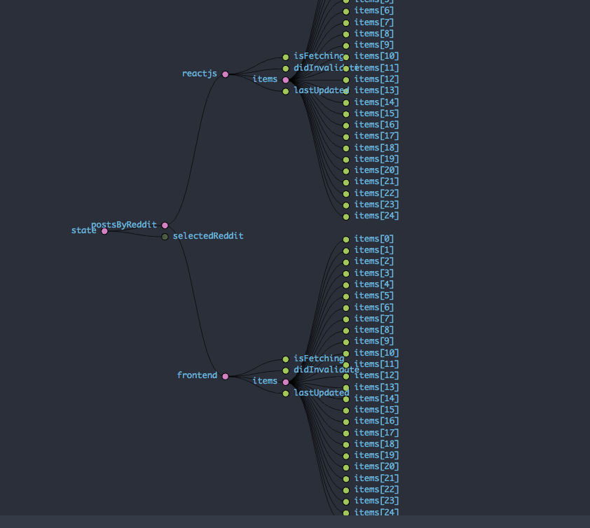
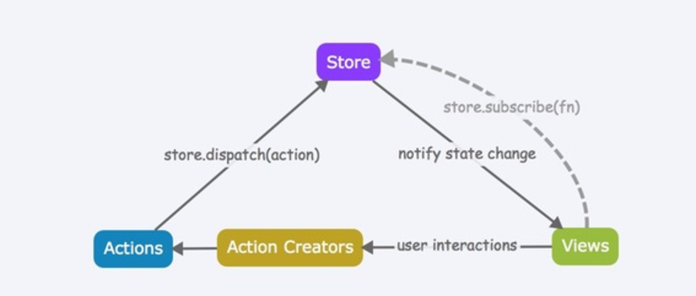

 关于Redux刚刚刚刚入门者对Redux的理解和使用
---

临危受命，一周各种熬夜突击redux，好吧，刚开始真的各种香菇蓝瘦，前天还熬到凌晨五点多，写了点demo，有点感觉，一点点记录下。这里简单介绍下Redux以及其与react结合的使用方法

___
最近学习东西太多太杂，经常与人交流讨论，新建的群，欢迎加入： 
Node.js技术交流群：209530601  
React技术栈：398240621
___
说明：因为笔者也是入门，如有扯淡扯错了，还望各路大神指教。

我们为什么需要Redux，什么是Redux
===
了解过react，我想大家对state都不陌生，而对于JavaScript单页面日趋复杂的今天，JavaScript需要管理越来越多的state，而这些state包括着各种乱七八糟途径来的数据。甚至有的应用的state会关系到另一个组件的状态。所以为了方便对这些state的管理以及对state变化的可控性。Redux这个东西就出来了！没错，就是为了让state的变化变得可预测！

那么redux到底是什么呢？
这里非权威的解释：就是一个应用的state管理库，甚至可以说是前端数据库。更包括的是管理数据。
不懂？OK，不懂就对了。。。
介绍完Redux和react-redux的基本概念我再通俗的解释下。

Redux的基本概念
===
state
---
state才是真正的前端数据库，它存储着这个应用所有需要的数据。
这里拿一个[简单的例子](./counter)说明下,为什么说简单的例子呢，因为简单到不应该使用redux。。。
运行效果如图(学习redux这个例子被介绍烂了)：

项目的运行效果大家应该能猜到哈，猜不到的clone下项目几几运行下:-)
所以这里的如说问你，这个应用应该存在数据里什么数据呢？对的，就一个count，所以数据库就存一个count就可以了，同理，这个应用的state其实就酱紫：

注释错了，是count值为3  .╥﹏╥...

这里展示的不是很明显，可以拿我们下一篇博客的demo来查看下它的 state

所以说道这里，大家对于state就已经明白了，需要说明一下的是，一个应用只应该有一个state。对，不管多大，就一个！

action
---
既然这些state已经有了，那么我们是如何实现管理这些state中的数据的呢，当然，这里就要说到action了。
什么是action？E:action,中：动作。
是的，就是这么简单。。。 
只有当某一个动作发生的时候才能够触发这个state去改变，那么，触发state变化的原因那么多，比如这里的我们的点击事件，还有网络请求，页面进入，鼠标移入。。。所以action的出现，就是为了把这些操作所产生或者改变的数据从应用传到store中的有效载荷。
需要说明的是，action是state的唯一来源。 
action也没有什么神秘，本质上就是一个JavaScript对象，但是约定的包含type属性（你总得告诉你这个action是啥嘛），可以理解成每个人都要有名字一般。除了type属性，别的属性，都可以DIY~ 
那么这么多action一个个手动创建必然不现实，一般我们会写好action creator，即action的创建函数。调用action creator，给你返回一个action。

比如这个counter应用，我们就有两个action，一个decrement，一个increment。
所以这里的action creator写成如下：

    export function decrement() {
        return{
            type:DECREMENT_COUNTER
        }
    }
    
    export function increment(){
        return{
            type:INCREMENT_COUNTER
        }
    }

好吧，藏也藏不住了，你也发现了这里有另外两个按钮，干嘛的？奇数是点击+1、延迟+1，对应的action creator：

    export function incrementIfOdd(){
        return(dispatch,getState)=>{
            const {counter} = getState();
            if(counter%2==0) {
                return;
            }
            dispatch(increment());
        }
    }
    
    export function incrementAsync() {
        return dispatch => {
            setTimeout(() => {
                dispatch(increment());
            }, 1000);
        };
    }

 好吧，又被你发现了，不是说action creator返回的是一个action对象么，你这返回的什么鬼？这里留个疑惑好吧，简单的解释，
 为什么可以这么用呢，因为我用了中间件呀~（后续会介绍）
 
 为了减少样板代码，我们使用单独的模块或文件来定义 action type 常量
 
     export const INCREMENT_COUNTER = 'INCREMENT_COUNTER';
     export const DECREMENT_COUNTER = 'DECREMENT_COUNTER';

这么做不是必须的，在大型应用中把它们显式地定义成常量还是利大于弊的。

如果我都快把action说完了你还是不懂action是什么的话，你就理解成，一个可能！改变state的动作包装。

reducer
---
既然这个可能改变state的动作已经包装好了，那么我们怎么去判断并且对state做相应的改变呢？对，这就是reducer干的事情了。
从一开始我们就说明下一个概念:

<b>reducer决定了state的最终格式。</b>

reducer是一个纯函数，也就是说，只要传入参数相同，返回计算得到的下一个 state 就一定相同。没有特殊情况、没有副作用，没有 API 请求、没有变量修改，单纯执行计算。

reducer对传入的action进行判断，然后返回一个通过判断后的state，这就是reducer的全部职责。
从代码可以简单地看出：

    import {INCREMENT_COUNTER,DECREMENT_COUNTER} from '../actions';
    
    export default function counter(state = 0,action) {
        switch (action.type){
            case INCREMENT_COUNTER:
                return state+1;
            case DECREMENT_COUNTER:
                return state-1;
            default:
                return state;
        }
    }
这里我们就是对增和减两个之前在action定义好的常量做了处理。

对于一个比较大一点的应用来说，我们是需要将reducer拆分的，最后通过redux提供的combineReducers方法组合到一起。
如此项目上的：

    const rootReducer = combineReducers({
        counter
    });
    
    export default rootReducer;
    
 虽然这里我们就一个counter    (ಥ_ಥ)   但是道理你懂得。
 
 这里你要明白：每个 reducer 只负责管理全局 state 中它负责的一部分。每个 reducer 的 state 参数都不同，分别对应它管理的那部分 state 数据。
 combineReducers() 所做的只是生成一个函数，这个函数来调用你的一系列 reducer，每个 reducer 根据它们的 key 来筛选出 state 中的一部分数据并处理，
 然后这个生成的函数再将所有 reducer 的结果合并成一个大的对象。
 
 store
 ---
 store是对之前说到一个联系和管理。具有如下职责
 + 维持应用的 state；
 + 提供 getState() 方法获取 state
 + 提供 dispatch(action) 方法更新 state；
 + 通过 subscribe(listener) 注册监听器;
 + 通过 subscribe(listener) 返回的函数注销监听器。
 
 后面两个不怎么用哈~
 
再次强调一下 Redux 应用只有一个单一的 store。当需要拆分数据处理逻辑时，你应该使用 reducer 组合 而不是创建多个 store。
store的创建通过redux的createStore方法创建，这个方法还需要传入reducer，很容易理解：毕竟我需要dispatch一个action来改变state嘛。
应用一般会有一个初始化的state，所以可选为第二个参数，这个参数通常是有服务端提供的，传说中的Universal渲染。后面会说。。。
第三个参数一般是需要使用的中间件，通过applyMiddleware传入。

说了这么多，action，store，action creator，reducer关系就是这么如下的简单明了：

接合react-redux的使用
===
说到react-redux，必然想到react和redux，是的，react-redux正是redux和react的桥梁工具。

react-redux将组建分成了两大类，UI组建和容器组建。
简单的说，UI组建负责美的呈现，容器组件负责来帮你盛着，给你"力量"

好吧，官方点：
UI 组件有以下几个特征：
+ 只负责 UI 的呈现，不带有任何业务逻辑
+ 没有状态（即不使用this.state这个变量）
+ 所有数据都由参数（this.props）提供
+ 不使用任何 Redux 的 API

如：

    export default class Counter extends Component{
        render(){
            const {counter,increment,decrement,incrementIfOdd,incrementAsync} = this.props;
            return(
                

                    Clicked:{counter} times
                    {'  '}
                    <button onClick={increment}>+</button>
                    {'  '}
                    <button onClick={decrement}>-</button>
                    {'  '}
                    <button onClick={incrementIfOdd}>increment if Odd</button>
                    {'  '}
                    <button onClick={incrementAsync}>increment async</button>
                

            )
        }
    }
    
容器组件特性则恰恰相反：
+ 负责管理数据和业务逻辑，不负责 UI 的呈现
+ 带有内部状态
+ 使用 Redux 的 API

如：

    class App extends Component{
        render(){
            const {counter,increment,decrement,incrementIfOdd,incrementAsync} = this.props;
            return(
                <Counter
                    counter={counter}
                    increment={increment}
                    decrement={decrement}
                    incrementIfOdd={incrementIfOdd}
                    incrementAsync={incrementAsync}/>
            )
        }
    }
    
    App.propTypes = {
        counter:PropTypes.number.isRequired,
        increment:PropTypes.func.isRequired,
        decrement:PropTypes.func.isRequired,
        incrementIfOdd:PropTypes.func.isRequired,
        incrementAsync:PropTypes.func.isRequired
    };
    
    export default connect(
        state=>({
            counter:state.counter
        }),
        ActionCreators
    )(App);

说到这里大家应该都懂，那么问题来了，redux和react如何产生点关系呢？？不难想到，如果产生关系肯定只要跟容器组件产生关系就可以了，毕竟他是react这些组件的老祖宗。
那么如何产生关系呢？？对的，就是上面代码里的，react-redux中的connect方法。

connect方法接受两个参数：mapStateToProps和mapDispatchToProps。它们定义了 UI 组件的业务逻辑。前者负责输入逻辑，即将state映射到 UI 组件的参数（props），
后者负责输出逻辑，即将用户对 UI 组件的操作映射成 Action。

比如这样：

    export default connect(
      state => ({ counter: state.counter }),
      ActionCreators
    )(Counter);
 因为作为组件，我们只要能拿到值，能发出改变值得action就可以了，所以mapStateToProps和mapDispatchToProps正是满足这个需求的。
 
 当时对这个connect也是好一顿理解
 
 这么通俗的说你该明白了吧
 ===
 可以吧所有的组件想象成装在一个罐子里，这个罐子使用container做的，然后这个罐子的唯一的口就是里面的东西想要去改变的唯一途径。
 说白了，这个口，就是connect，而redux中的所有的组件都是在罐子外面的。
 
 reducer是改变state的，state就可以可以理解成组件的粮食，需要的时候redux就把粮食通过dispatch投入到罐子里。
 那么我怎么知道你需要呢？所以我们之间得有个约束，你喊一声饿了，我就知道你要吃饭了，你喊一声渴了，我就知道你要喝水了。
 这些动作，就是你发出的action，喊得词语，饿了，渴了，就是action.type，然后redux拿给军事reducer解读下，到底给罐子里投入什么。
 
 不知道这么通俗的解释有没有说明白   (*T_T*) 
 
 所以这样看来，组件通过container包装以后和redux就可以说是完全隔绝了，组件就是做组件的事情，redux就是做redux的事情。中间的枢纽是connect。
 这也就说明了，redux并不是只服务我们react哒~也即是我这一套逻辑在罐子外面，罐子里面是什么其实我并不是很在意。。。只要我们预定好action和state就可以了。
 
 所以。。。redux也并没有特别神秘的地方。
 当然，这里只是简单的说了下redux的简单概念，并没有特别深入的讲解。
 关于redux的异步操作，以及在服务端的运行（node），universal渲染，结合react-router的使用等等等的功能，咱再慢慢了解慢慢研究慢慢总结哈~ 
  
  
  
  
  ヾ(^▽^ヾ)
 
 
 